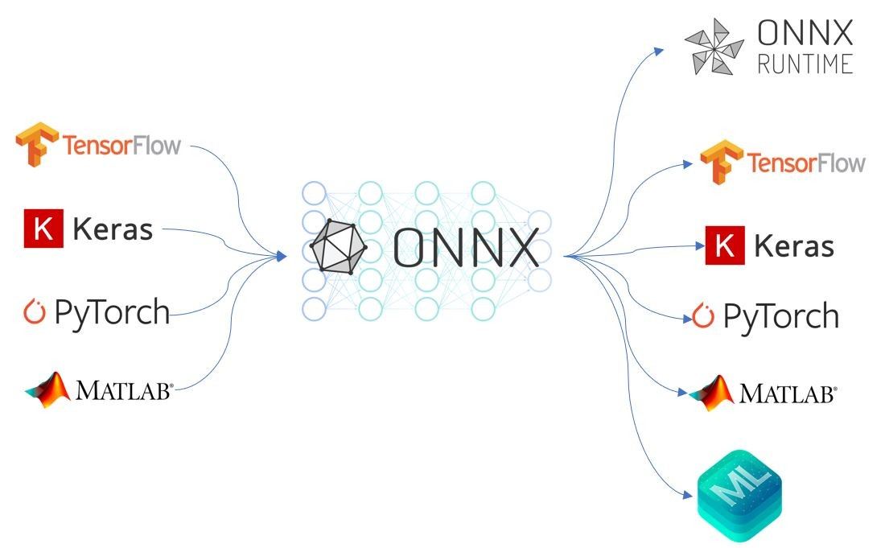
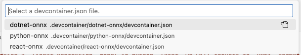

# ONNX Public

This is a public Repository to help begineers understand the fundamentals of ONNX. 



##### We will be creating a `linear Regression` model in python. later, we will convert to `ONNX` format. To demonstrate the power of `onnx` , we will be consuming the same model in `dotnet` and later in `browser` as well.

The project is supported by [`devcontainers`](https://docs.github.com/en/codespaces/setting-up-your-project-for-codespaces/adding-a-dev-container-configuration/introduction-to-dev-containers). Make sure you have this [`VS Code`](https://marketplace.visualstudio.com/items?itemName=ms-vscode-remote.remote-containers) extension (mandatory)

Later, open VS Code Command Palette.

**Mac** : `Shift` + `Command` + `P` <br>
**Windows/Linux** : `Ctrl` + `Shift` + `P` <br>

Select `Dev Containers: Rebuild and Reopen in Containers` if you are building for the first time or `Dev Containers: Reopen in Containers` if you have existing container.

#### [1. Python Linear Regression Model](#1-python-linear-regression-model)


To Open this project, select `python-onnx` in devcontainers. The solution will re-open in devcontainer mode and it will install all required packages and VS Code extensions needed for this project automatically.

The code does the following

- Use `PyTorch` library to create `Linear Regression` model
- The model can be expressed with `y = mx + c` equation.
- We will create dataset with values for `y` and `x`
- Later, we will train the model and during this training , the model will figure out values for `m` and `c`.
- lets say the model figured out values for `m` and `c` and it came up with `y = 3.5x + 4 `. This will be our final model that is ready to be deployed or converted to `onnx`
- Since we are using `pytorch` , it has an in-built way of converting models to `onnx`. More about [ONNX Converters](https://onnx.ai/onnx/intro/converters.html).

##### Run locally

1. Open terminal, run `python linear.py` . This will generate both `linear_regression_model.pth` (save pytorch model in its own compatible model) and `linear_regression_model.onnx` ( universal compatible model )
2. Not pushing the above models into repo. 

#### [2. Use the `ONNX` model in dotnet](#2-use-the-onnx-model-in-dotnet)


To Open this project, select `dotnet-onnx` in devcontainers. The solution will re-open in devcontainer mode and it will install all required packages and VS Code extensions needed for this project automatically.

Copy the `onnx` model you created in [python project](#1-python-linear-regression-model) into root of this solution. Since we are using `ONNX Runtime`, we need not have any `python` related dependencies installed to run the `onnx` model. 

Take a look at the `.csproj` to understand what libraries are required.

##### Run Locally

1. Open Terminal , type `dotnet build` to make sure everything is in place.
2. change the input value in line 56. This is the value of `x` in equation `y = mx+c`. the `onnx` model already knows `m` and `c`.
3. type `dotnet run` and look at the result i.e `y`.

This way we can conclude that a model that is developed in `python` can be used in `dotnet` as well and vice versa.

#### [3. Use the `ONNX` model directly in browser](#3-use-the-onnx-model-directly-in-browser)


To Open this project, select `react-onnx` in devcontainers. The solution will re-open in devcontainer mode and it will install all required packages and VS Code extensions needed for this project automatically.

Copy the `onnx` model you created in [python project](#1-python-linear-regression-model) into `src\assets\`. Since we are using `ONNX Runtime`, we need not have any `python` related dependencies installed to run the `onnx` model. 

note the packages required.
```
 "dependencies": {
    "onnxruntime-web": "^1.19.2",  < -- most and only important library
    "react": "^18.3.1",
    "react-dom": "^18.3.1",
    "vite-plugin-static-copy": "^1.0.6" 
  },
```

##### Run locally

1. Open terminal and type `nom run dev`.
2. enter the value of `x` for equation ` y= mx + c` in the textbox give
3. click on the button to generate the output value i.e. `y`.

